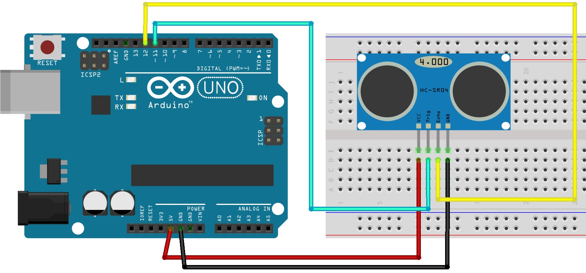

# POCUltraSonicUitlezen
Proof Of Concept Uitlezen Ultrasonic Sensor Arduino

## Getting Started
Download Arduino IDE, download POC_Data_Uitlezen_UltraSonic.ino en open deze met de Arduino IDE. 
Sluit Arduino setup aan, selecteer de juiste poort en run POC_Data_Uitlezen_UltraSonic.ino

## Prerequisites
De juiste Arduino Setup is hiervoor nodig.

## Built With
* Arduino IDE - Code editor for Arduino

## Authors
Maik Henckens - Initial work - Maik Henckens

## Acknowledgments
YouTube tutorials

